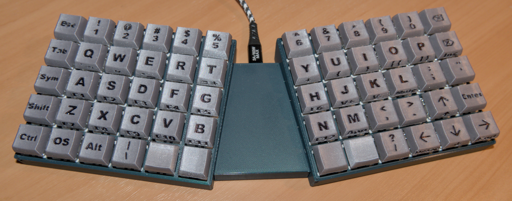

# MKSP

## Modular Keyboard for Small Printers

I wanted to print an ortholinear keyboard using my Prusa Mini 3d printer, 
but most case designs are just too wide for this diminuitive printer.
Instead I decided to design one myself using FreeCAD.

The new Mk2 is currently a work in progress. It is an evolution of the Mk1,
but is also a complete reimplementation using the lessons learnt, both from
the modelling and from using the keyboard as my daily driver.

## Controller

The design currently uses a Waveshare RP2040-Plus, which is a Raspberry Pi
Pico clone, but with a better USB-C connector.

## Firmware

I originally planned to use KMK as I'm lazy as it looked really easy to use.
Unfortunately this uses CircuitPython which did not then officially support
the RP2040-Plus, resulting in some really odd crashes.

Because of this I changed to QMK, which surprisingly wasn't as difficult to use
as I'd expected, and this seems to work perfectly.

## Mk2 Changes

- Complete reimplementation so that the CAD model no longer breaks when parameters
are changed.
- The keyboard layout has been further developed:
    - Space keys are now double sized.
    - There's an extra shift key on the right.
    - A Pause key has been added.
- In addition to the original sloped key base there is also now a flat base, which has
an attachable leg in order to privide the required angle.
- The key caps have been completely redesigned:
    - The stem fits better so the keys are smoother.
    - The key shape has been changed so that the symbol legends on the front can be
    more easily seen.
    - It's also possible to print the keycaps with no supports.
