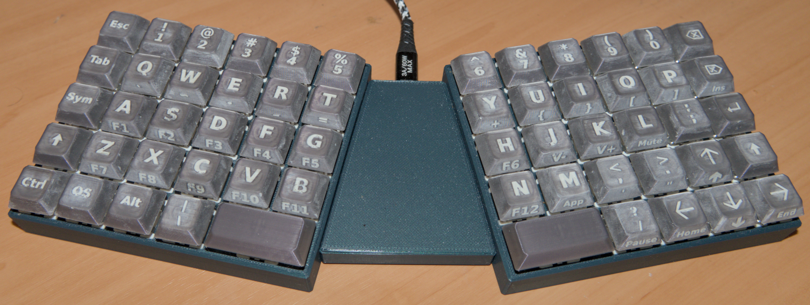

# MKSP

## Modular Keyboard for Small Printers

I wanted to print an ortholinear keyboard using my Prusa Mini 3d printer, 
but most case designs are just too wide for this diminuitive printer.
Instead I decided to design one myself using FreeCAD.

The new Mk2 is an evolution of the Mk1, but is also a complete reimplementation
using the lessons learnt, both from the modelling in FreeCAD and from using the
keyboard as my daily driver.

## Controller

The design currently uses a Waveshare RP2040-Plus, which is a Raspberry Pi
Pico clone, but with a better USB-C connector.

## Firmware

The keyboard uses [QMK](https://qmk.fm/). All of the configuration files are
provided in the locations in which they are expected to be added.

## Mk2 Changes

- Complete reimplementation so that the CAD model no longer breaks when parameters
are changed.
- The keyboard layout has been further developed:
    - Space keys are now double sized.
    - There's an extra shift key on the right. It turns out that it's not really optional.
    - A Pause key has been added. This is needed to scroll back in the console when using
      FreeBSD in text mode.
- In addition to the original sloped key base there is also now a flat base, which has
an attachable leg in order to privide the required angle. This provides a nice clean print
with no steps. The old case style is also available and has also been reimplemented.
- The key caps have been completely redesigned:
    - The stem fits better so the keys are much smoother.
    - The key shape has been changed so that the symbol legends on the front can be
    more easily seen.
    - It's also possible to print the keycaps with no supports.
